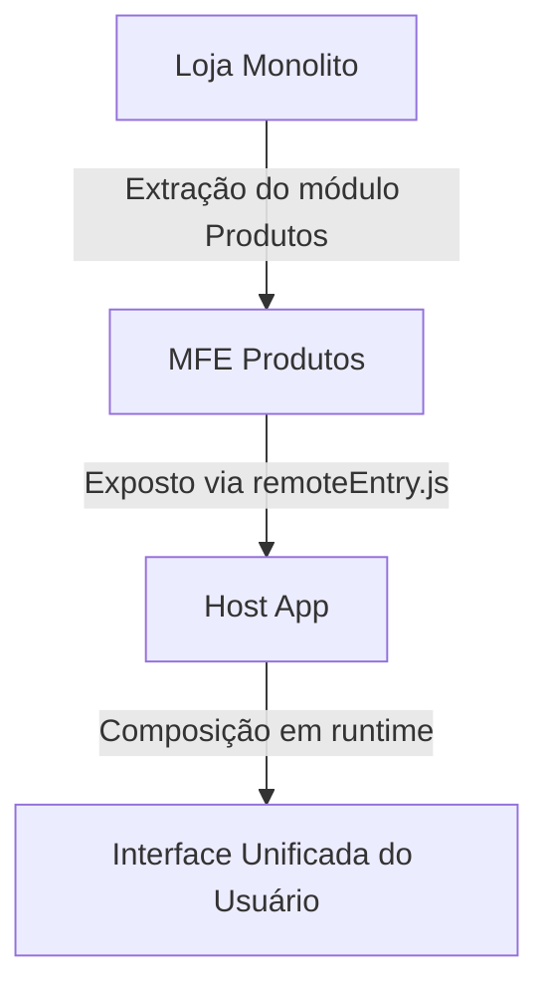

# 🧩 Prova de Conceito – Arquitetura com Micro Frontends

Este repositório contém a estrutura inicial da **Prova de Conceito (PoC)** desenvolvida para o TCC  
**_“Do Monolito à Autonomia: Uma Abordagem Aplicada com Micro Front-ends e Entrega Contínua”_**.

O objetivo é demonstrar, de forma prática, a **extração modular** de um módulo funcional de uma aplicação monolítica Angular para um **micro frontend independente**, validando princípios de modularização, integração federada e autonomia de entrega contínua.

---

## 📁 Estrutura do Projeto

```bash
poc-microfrontends/
├── loja-monolito/          # Aplicação monolítica base (porta 4200)
├── mfe-produtos/           # Micro frontend de produtos (porta 4201)
└── host-app/               # Aplicação host/container (porta 4202)
```

### 🔹 Descrição dos Módulos

- **loja-monolito:** Aplicação Angular simulando um sistema legado. Contém o módulo de produtos antes da extração.  
- **mfe-produtos:** Micro frontend independente que replica e mantém a funcionalidade de produtos.  
- **host-app:** Aplicação container configurada com **Webpack Module Federation**, responsável por compor dinamicamente os micro frontends em tempo de execução.

---

## 🛠️ Tecnologias Utilizadas

| Tecnologia | Função |
|-----------|-------|
| **Angular 20+** | Framework base de front-end |
| **Webpack Module Federation** | Composição dinâmica de MFEs |
| **TypeScript** | Tipagem estática |
| **Express** | Suporte a SSR/servidor quando necessário |
| **Bootstrap / Bootswatch** | Estilização responsiva |
| **pnpm** | Gerenciador de pacotes |
| **Git / GitHub** | Versionamento e CI/CD |
| **Karma / Jasmine** | Testes unitários |

> Observação: os apps utilizam os _builders_ do Angular (`@angular-devkit/build-angular` ou `@angular/build`, conforme o projeto). **Vite não é necessário** para esta PoC.

---

## ⚙️ Pré-requisitos (instalações)

1. **Node.js 18+**  
   Download: https://nodejs.org/en/download/  
   Verificação:
   ```bash
   node -v
   npm -v
   ```

2. **pnpm (global)**  
   ```bash
   npm install -g pnpm
   pnpm -v
   ```

3. **Git**  
   Download: https://git-scm.com/downloads

4. **Angular CLI (opcional, recomendado)**  
   ```bash
   pnpm add -g @angular/cli
   ng version
   ```

> As dependências específicas de cada app (Angular, builders, Bootstrap etc.) já estão nos respectivos `package.json` e serão instaladas com `pnpm install`.

---

## ⬇️ Clonar o Repositório

```bash
git clone https://github.com/<seu-usuario>/poc-microfrontends.git
cd poc-microfrontends
```

---

## 📦 Instalação das Dependências (por aplicativo)

```bash
# Aplicação Monolítica
cd loja-monolito
pnpm install

# Micro Frontend
cd ../mfe-produtos
pnpm install

# Aplicação Host (container)
cd ../host-app
pnpm install
```

---

## 🚀 Como Executar o Projeto (três terminais)

```bash
# 1️⃣ Aplicação Monolítica (porta 4200)
cd loja-monolito
pnpm start

# 2️⃣ Micro Frontend de Produtos (porta 4201)
cd mfe-produtos
pnpm start

# 3️⃣ Aplicação Host/Container (porta 4202)
cd host-app
pnpm start
```

### 🌐 Endpoints Locais

| Aplicação | Descrição | URL |
|-----------|-----------|-----|
| **Loja Monolito** | Aplicação legada base | http://localhost:4200 |
| **MFE Produtos** | Micro frontend independente | http://localhost:4201 |
| **Host App** | Container que compõe o MFE dinamicamente | http://localhost:4202 |

> Dica: suba o **mfe-produtos** antes do **host-app**, pois o host carrega o `remoteEntry.js` do MFE em tempo de execução.

---

## 📜 Scripts Disponíveis

### `mfe-produtos`

| Script | Descrição |
|-------|-----------|
| `pnpm start` | Inicia o servidor local (`ng serve`) |
| `pnpm build` | Gera o build de produção |
| `pnpm serve:ssr:mfe-produtos` | Executa o MFE com SSR via Express |
| `pnpm run:all` | Inicia o dev server federado com módulo remoto |

### `host-app` e `loja-monolito`

| Script | Descrição |
|-------|-----------|
| `pnpm start` | Inicia o servidor local (`ng serve`) |
| `pnpm build` | Compila para produção |
| `pnpm test` | Executa testes unitários (Karma/Jasmine) |

---

## 🧱 Arquitetura da Solução

A PoC simula a evolução de um **monolito** para **micro frontends** integrados via **Module Federation**:



### 🔧 Fluxo de Operação

1. O **módulo de Produtos** é extraído da aplicação **monolítica**.  
2. O módulo passa a ser um **MFE** independente (`mfe-produtos`).  
3. O **host-app** consome o MFE via **Module Federation** (carregamento dinâmico).  
4. O usuário navega por uma **interface unificada**, com deploys independentes por domínio.

---

## ⚙️ Configuração de CI/CD (GitHub Actions)

Pipeline inicial de **build** e **testes** (extensível para _preview deploy_ em Vercel/Netlify/GitHub Pages).

Crie o arquivo `.github/workflows/main.yml`:

```yaml
name: CI/CD - Micro Frontend Produtos

on:
  push:
    branches: [ main, dev ]
  pull_request:
    branches: [ main, dev ]

jobs:
  build-and-test:
    runs-on: ubuntu-latest

    steps:
      - name: Checkout do código
        uses: actions/checkout@v4

      - name: Instalação do Node e pnpm
        uses: actions/setup-node@v4
        with:
          node-version: 18
          cache: 'pnpm'

      - name: Instalar dependências
        run: pnpm install

      - name: Build de Produção
        run: pnpm build --configuration production

      # Opcional: testes
      # - name: Testes unitários
      #   run: pnpm test -- --watch=false
```

---

## 🎯 Objetivos da Prova de Conceito

- ✅ Viabilidade técnica da extração modular de um front-end legado  
- ✅ Integração dinâmica via **Webpack Module Federation**  
- ✅ Autonomia de build e deploy por micro frontend  
- ✅ Separação de responsabilidades por domínio funcional

---

## 🧩 Próximos Passos

- Comunicação entre MFEs (Shared Services, Custom Events, RxJS)  
- Deploy automatizado (Vercel, Netlify ou GitHub Pages)  
- Observabilidade (logs/métricas) — Datadog, GA4  
- Documentação técnica (diagramas e ADR) para o TCC

---

## 🛠️ Troubleshooting (erros comuns)

### `Cannot find builder "@angular/build:browser"`
Instale o _builder_ compatível e/ou use o _devkit_:
```bash
pnpm add -D @angular-devkit/build-angular@^20.0.1
```
Ajuste o `angular.json`:
```json
"builder": "@angular-devkit/build-angular:browser"
```

### `Cannot find builder "@angular-architects/module-federation:dev-server"`
Use o dev-server nativo do Angular no `host-app`:
```json
"serve": { "builder": "@angular-devkit/build-angular:dev-server" }
```

### Porta já em uso (EADDRINUSE)
Mude a porta no `angular.json`:
```json
"options": { "port": 4202 }
```

### MFE não carrega no Host (`404` em `remoteEntry.js`)
Garanta que o **mfe-produtos** esteja ativo e que a URL/porta do remoto no `webpack.config.js` do host esteja correta.

---

## 🧾 Licença

Projeto **exclusivamente educacional**, parte do TCC de **Thaís Araujo de Alencar**  
(MBA em Engenharia de Software – USP/ESALQ).  
Sem finalidade comercial.
